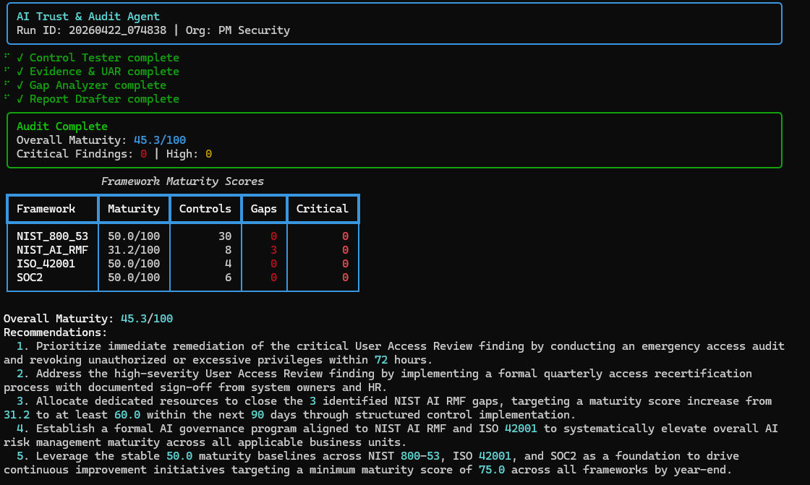
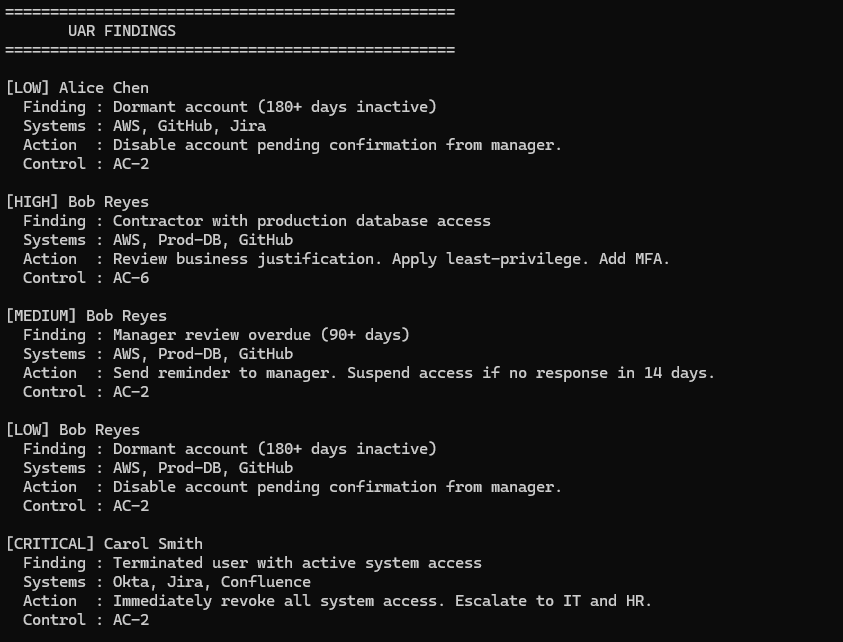
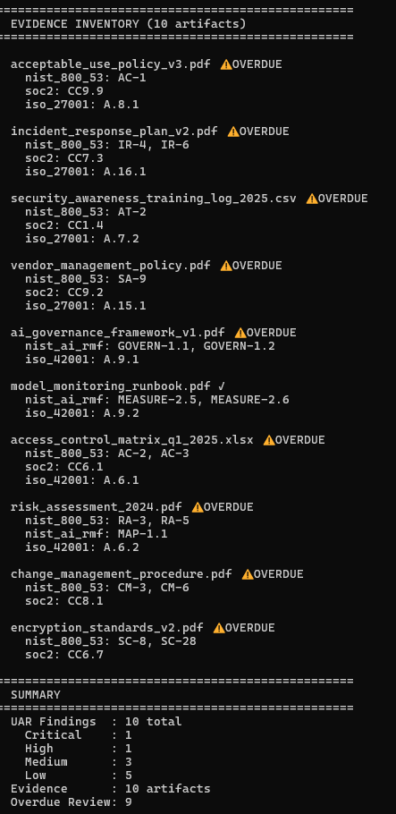
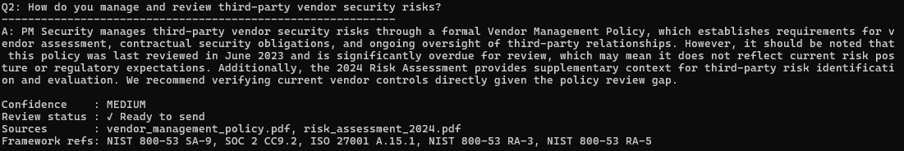
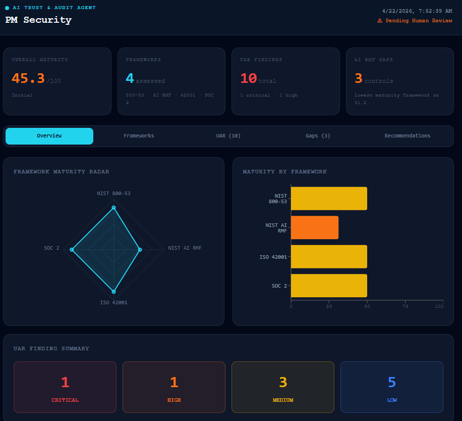
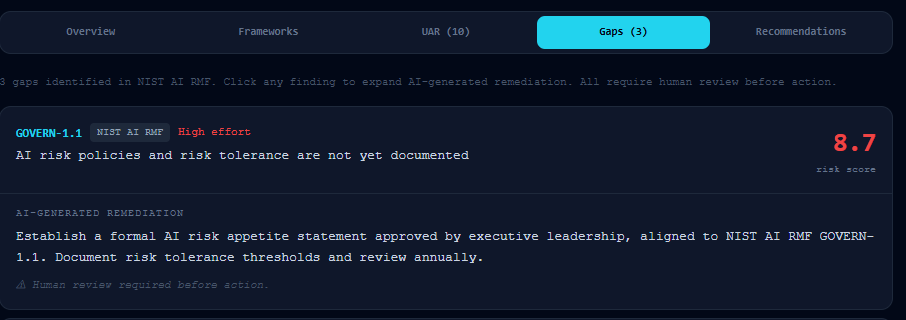

# AI Trust & Audit Agent (ATAA)
### AI-Native GRC Platform | NIST AI RMF · ISO 42001 · NIST 800-53 · SOC 2

A multi-agent AI system for automated governance, risk, and compliance (GRC) auditing. Built to demonstrate how AI can accelerate and enhance the full GRC lifecycle — from control testing and user access reviews to gap analysis and report generation.

> Built by Patricia Mae — GRC Analyst | AI Governance | Risk & Compliance


---

## Background

During my internship at Adobe on the Customer Trust & Audit team, I worked hands-on with customer-driven cybersecurity audits — collecting and organizing evidence, supporting control assessments across multiple security domains, and building Power BI dashboards to surface audit and compliance metrics for the team and leadership. At the time, much of this work was manual and process-heavy. In that same environment, I encountered Adobe's Common Controls Framework (CCF) — an open-source GRC automation platform built by Adobe's own Tech GRC team that rationalizes 4,300+ requirements from 21 industry standards into a unified control set, with automated evidence collection, real-time operating effectiveness checks, and a microservices rules engine underneath. I remember thinking I didn't fully understand yet what GRC engineering even meant, or why engineers were embedded within a GRC team at all — let alone what was possible when you applied it at scale with automation.

The scoring mechanics of ATAA trace back to my graduate capstone — an AI-Assisted GRC Decision Support Platform where I first built a deterministic weighted risk scoring model, NIST 800-53 control gap detection, and a structured audit pipeline in Python. That project taught me the mechanics. Then I connected the dots: Adobe's CCF showed me what enterprise-grade GRC automation looks like in production. My capstone showed me how to build the scoring engine. ATAA is what happened when I asked the next question — *what if instead of one platform, each function became its own intelligent agent?*

---

## What is an Agentic AI System?

If you're new to AI agents — I was too, until recently.

A traditional AI tool responds to one prompt at a time. An **agentic AI system** is different — it breaks a complex goal into subtasks, assigns each to a specialized agent, and chains their outputs together to produce a result no single model could achieve alone.

Think of it like a GRC team:
- One person tests controls
- Another collects evidence  
- Another analyzes gaps
- Another writes the report

Each has a specific role. Each hands off to the next. The manager (Orchestrator) makes sure nothing falls through the cracks.

ATAA works exactly the same way — except each "person" is a Python agent, the handoffs are validated automatically, and the whole pipeline runs in under 60 seconds.

> *Two weeks before building this, I was intimidated by the concept of AI agents. Then I attended BSides San Diego and heard how Meta, and companies across every industry, are already deploying agentic systems at scale. The message was clear: AI isn't replacing people who understand it — it's replacing people who don't. So I built one.*

---

## Architecture

```
Orchestrator
├── Control Tester Agent     → NIST 800-53 control validation + risk scoring
├── Evidence & UAR Agent     → Access reviews + evidence tagging across frameworks
├── Gap Analyzer Agent       → Multi-framework gap scoring + AI remediation
└── Report Drafter Agent     → Audit reports + customer questionnaire responses
```

### Why Multi-Agent?
Each agent has a single responsibility — keeping the system modular, testable, and extensible. The Orchestrator validates outputs between agents so errors are caught at handoff, not downstream.

### Hybrid AI Architecture
- **Deterministic scoring** for control assessment (auditable, reproducible)
- **Claude API** for remediation recommendations and questionnaire drafting (efficient, natural language)
- **Human-in-the-loop** review required before any AI-drafted content is sent externally


---

## Frameworks Covered

| Framework | Coverage |
|---|---|
| NIST SP 800-53 Rev 5 | 30 controls across AC, AU, CM, CP, IA, IR, SA, SC, SI families |
| NIST AI Risk Management Framework | GOVERN · MAP · MEASURE · MANAGE functions |
| ISO/IEC 42001:2023 | Annex A controls for AI management systems |
| SOC 2 Type II | Trust Service Criteria CC6, CC7, CC8, CC9 |

---

## Key Features

**Automated User Access Reviews**
Runs 5 deterministic UAR rules — flags terminated users with active access, contractors with production DB access, dormant accounts, and overdue manager reviews. Maps every finding to NIST 800-53 controls.

**Evidence Collection & Tagging**
Automatically tags evidence artifacts across all four frameworks. Flags overdue reviews and missing evidence for each control.

**Multi-Framework Gap Analysis**
Scores every control across NIST 800-53, NIST AI RMF, ISO 42001, and SOC 2 using a deterministic risk engine (Likelihood × Impact × Control Weight). Generates a 0–100 maturity score per framework.

**AI-Generated Remediation**
Calls Claude API to generate specific, actionable remediation guidance for each gap — citing the relevant framework and control. Deterministic scoring ensures reproducibility; AI handles natural language.

**Customer Security Questionnaire Responder**
Drafts professional answers to customer security questionnaires using your evidence library as context. Includes confidence scoring (high/medium/low) and mandatory human review for low-confidence answers.

**Immutable Audit Log**
Every agent action is recorded in a hash-chained append-only log. Any tampering breaks the chain — verifiable with `python main.py --verify-log`.

**GRC Engineering**
Implements the core principles of GRC engineering: automated control testing, rules-based evidence validation, and real-time compliance visibility — inspired by enterprise frameworks like Adobe CCF.

**Live React Dashboard**
Interactive dashboard with Framework Maturity Radar, Risk Score bar chart, UAR findings table, expandable gap cards with AI remediation, and strategic recommendations.

---

## Screenshots

### Full Audit Pipeline


### User Access Review Findings



### AI-Drafted Customer Security Questionnaire


### Live Audit Dashboard


### Gap Analysis with AI Remediation


---

## Quick Start

```bash
# 1. Clone the repo
git clone https://github.com/PatitaMae/ai-trust-audit-agent.git
cd ai-trust-audit-agent

# 2. Install Python dependencies
pip install -r requirements.txt

# 3. Set up config
cp config/config.example.yaml config/config.yaml
# Add your Anthropic API key to config/config.yaml

# 4. Run the full audit pipeline
python main.py

# 5. Run individual agents
python main.py --agent evidence_uar
python main.py --agent gap_analyzer

# 6. Run questionnaire responder
python main.py --questionnaire

# 7. Verify audit log integrity
python main.py --verify-log

# 8. Launch dashboard
cd ui && npm install && npm run dev
# Open http://localhost:5173
```

---

## Project Structure

```
ai-trust-audit-agent/
├── agents/
│   ├── orchestrator.py          # Workflow router + schema validation
│   ├── control_tester.py        # NIST 800-53 control scoring
│   ├── evidence_uar_agent.py    # UAR rules + evidence tagging
│   ├── gap_analyzer.py          # Multi-framework gap scoring + Claude API
│   └── report_drafter.py        # Report generation + questionnaire drafting
├── scoring/
│   ├── risk_engine.py           # Deterministic risk scoring engine
│   ├── recommendations.json     # Pre-mapped remediation guidance
│   └── cg_score_mapping.json    # Coverage gap scoring rubric
├── frameworks/
│   └── nist_800_53.json         # Control catalog with assessment scores
├── data/
│   ├── asset_inventory.json     # Asset CIA scores and criticality
│   ├── risk_register.json       # Risk register with threat mappings
│   ├── kri_catalog.json         # Key Risk Indicators
│   └── evidence/
│       └── threat_control_map.json  # Threat → control mappings
├── audit_log/
│   └── logger.py                # Hash-chained immutable audit trail
├── ui/
│   └── AuditDashboard.jsx       # React dashboard
├── models.py                    # Shared Pydantic data models
├── main.py                      # CLI entry point
└── requirements.txt
```

---

## Scoring Methodology

Controls are scored across three dimensions:

| Dimension | Question |
|---|---|
| Design Effectiveness | Is the control well-designed on paper? |
| Operating Effectiveness | Is it actually being followed? |
| Evidence Quality | Can you prove it with artifacts? |

```
Risk Score = Likelihood × Impact × Control Weight (0–10)
Maturity   = f(Design, Operating, Evidence)        (0–4 → CMMI scale)
```

This mirrors how Big 4 auditors (Deloitte, PwC, KPMG) assess controls and aligns with GRC platforms like Vanta, AuditBoard, and Drata.

---

## Tech Stack

- **Python 3.10+** — agents, scoring engine, CLI
- **Anthropic Claude API** — remediation generation, questionnaire drafting
- **Pydantic** — data validation between agents
- **React + Vite** — dashboard frontend
- **Recharts** — data visualizations
- **Rich** — terminal output formatting

---

## Roadmap
- [ ] v2.0 — Semantic Questionnaire Engine -Map questions across multiple audit formats to unified controls regardless of wording (architecture preview coming soon)
- [ ] Document Parser Agent — auto-extract questions from PDF, Excel, and email formats
- [ ] Vendor Risk Agent — third-party risk scoring pipeline
- [ ] KRI Monitoring Agent — real-time key risk indicator tracking
- [ ] Policy Review Agent — automated policy staleness detection
- [ ] Trend Analysis — maturity score tracking across audit runs
- [ ] GRC Platform Integration — Vanta, Drata API connectors
- [ ] Scheduled audit runs with trend tracking
- [ ] Export audit reports to PDF
- [ ] SOC 2 evidence package generator

---

## 👩About

Built as a portfolio project to demonstrate AI-native GRC capabilities combining:
- Deep GRC domain knowledge (NIST 800-53, AI RMF, ISO 42001, SOC 2)
- Multi-agent AI system design
- Deterministic risk scoring with LLM augmentation
- Production-grade software patterns (schema validation, immutable audit logs, human-in-the-loop)

**Connect:** [LinkedIn](https://linkedin.com/in/patriciamaesantos) | [GitHub](https://github.com/PatitaMae)
